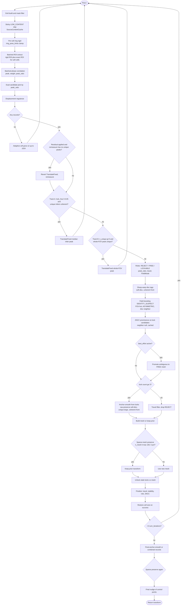
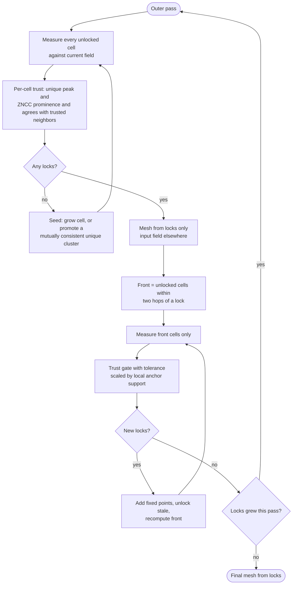

# Refine-grid step inventory (Sept 2026)

Companion to [`grid16_stos_cell_role_theory.md`](grid16_stos_cell_role_theory.md) and
[`grid16_rc2_refine_failure_modes.md`](grid16_rc2_refine_failure_modes.md).

Purpose: list every step `RefineTransform` executes per pass, the constants each carries,
the Grid16 pair that motivated it, and which question about **trust** it is answering.
Governing principle (original design intent): **only trusted cells shape the field**. Most
of the steps below exist because that principle was never enforced at the mesh, so each
symptom of an untrusted mesh got its own patch.

Evidence for this inventory: RC2 Grid16 `1215-1214` Manual (rigid, center band registers,
edges fan out — drying-front deformation), run twice on 2026-09-13.

## 1. Current per-pass flow

## 2. Inventory

Trust question column: what each step is really asking. `M` = measurement (produces
evidence), `T` = per-cell trust gate, `P` = proxy for an untrusted mesh, `S` = seeding
when nothing is trusted, `G` = safety guard, `X` = performance.

| # | Step | Module | Constants | Motivating pair | Trust question | 1215-1214 observed | Disposition |
|---|------|--------|-----------|-----------------|----------------|--------------------|-------------|
| 1 | Sticky LOW_CONTENT skip | `source_content_cache.py`, `cell_validity.py` | `LOW_CONTENT_STD_MIN=1e-3` | dirt / blank cells | T: is there tissue to measure? | 0 skipped | Keep; make mask-aware (plan item 7) |
| 2 | Ring rigid per cell | `ApproximateRigidTransformBySourcePoints`, `ring_pose_limits.py` | `RING_SCALE_FRACTION_MAX=0.05`, `RING_ANGLE_MAX_DEGREES=15` | bent meshes | M: local prior from the current field | Rigid input: identical prior for every cell every pass | Keep; it is the mechanism by which anchors propagate, once the mesh is trusted |
| 3 | Dual-candidate ROI (rigid vs exact) | `_soft_rigid_cells`, `_choose_translation_candidates` | `PEAK_RATIO_EARLY=1.50` | local shear | M | n/a | Keep; unify serial pick (plan item 2) |
| 4 | Batched phase correlation, `peak_ratio` | `batched_phase_correlation.py`, `peak_uniqueness.py` | `PEAK_RATIO_MIN=1.20` (provisional) | all | T: is this peak unique? | 36/79 unique at 512; 196/290 at 256 | Keep as primary trust signal; calibrate (plan item 6) |
| 5 | Displacement regularize | `displacement_regularize.py` | — | — | M | — | Keep |
| 6 | Adaptive cell grow / restore | `adaptive_cell_size.py` | `MAX_REFINE_CELL_SIZE=1024`, `MIN_REGISTRATIONS_TO_RESTORE=3` | wrap on small cells | S: nothing measurable, widen the window | Grew to 1024 after bogus shift (run 0) | Keep for seeding only; per-cell rather than global later |
| 7 | Track A coherent residual | `coherent_residual.py` | `LOCK_FRAC_TRIGGER=0.05`, `COHERENCE_MIN=0.85`, `MIN_UNIQUE_PEAKS=50`, `INLIER_COS_MIN=0.5` | 240-241 | S: is the whole pose off by one translation? | 256 run: applied 68 px with reported coherence 0.968 on 102 of 196 inliers; coherence of all 196 was **0.086**. Inlier pre-selection manufactures coherence. `MIN_UNIQUE_PEAKS=50` unreachable on a 79-cell grid. | Make honest (whole-set coherence, fraction of grid) or delete |
| 8 | Track B whole-FOV residual | `coherent_residual.py` | `GLOBAL_FOV_MAX_DIM=512`, now `PEAK_RATIO_MIN` gate | 240-241 wrap soup | S | Applied `peak_ratio=0.95` peak, 2654-3510 px; section jumped. Now rejected. | Delete. Its only safe output is "do nothing" |
| 9 | Residual revert | `residual_remeasure_should_revert` | `min_records=3`, `min_unique=3` | 1215-1214 | G: did the translation destroy evidence? | Previously never fired (46 ambiguous records counted as fine) | Keep while 7 exists; goes away with 7 and 8 |
| 10 | Roles REJECT / FREE / LOCKABLE / IDENTITY_SUSPECT | `cell_roles.py` | `ACTIVE_UNIQUE_FIELD_MIN=20` | 241-242 | T | reject 39-40, free 36-37, lockable 0 at 512 | Keep the per-cell part; FieldMode / branding is a proxy (see 12) |
| 11 | Sharp-warp disc tags, soft-disc, coherent front | `discontinuity.py`, `cell_roles.py` | `DISC_FRONT_MIN_CELLS=6`, `DISC_FRONT_COHERENCE_MIN=0.70` | 252-254 | P: which untrusted cells may still bend the mesh? | 34 tagged disc at final (256 run) | Fold into trusted-mesh rule; a coherent front is a set of cells that agree with their trusted neighbors |
| 12 | Field branding (FOV-hot, ASYMMETRIC, disc neighbor) | `cell_roles.py` | `0.5 * max_travel`, `travel_eps` | 241-242 | P: which identity locks are frozen bubble, not tissue? | `identity_suspect=3-8` | Fold: an identity lock disagreeing with trusted neighbors is untrusted; no field-level mode needed |
| 13 | ZNCC prominence (neighbor null, cached) | `cell_roles.py`, `_compute_zncc_for_candidates` | `ZNCC_PROMINENCE_MIN=4.0` | dirt / false identity | T: does the peak beat its local null? | prom_med 2.9 at 512 (0 pass); 4.0-6.3 at 256 | Keep as second trust signal; calibrate (plan item 6) |
| 14 | best_effort mode and ambiguous mesh promote | `best_effort.py` | `IDENTITY_LOCK_CAND_FRAC=1/3`, `HIGH_TRAVEL_FRAC_MIN=0.04`, quantiles 0.75 / 0.5 | 953-952 | P: mesh too thin, admit weaker cells | active at 512, promoted nothing useful | Delete once mesh is trust-gated; the front supplies the "next weakest" cells in order |
| 15 | Anchor-smooth mesh with raw-preserve | `anchor_smooth.py` | `min_anchor_count=3` | 241-242, 252-254 | P: let a few locks dominate an otherwise noisy mesh | 9 seeds smoothing 290 cells with 165 raw-preserved unvetted peaks | Replace by trusted-mesh rule: locks plus front cells only |
| 16 | Travel filter, drop REJECT, `_build_mesh_transform_or_keep` | `finalize.py`, `local_distortion_correction.py` | `max_travel_for_finalization`, `inclusion_travel_multiplier` | 228-229 | P | 15-16 of 79 survived at 512 | Subsumed by trusted-mesh rule |
| 17 | Sparse-mesh preserve (mid-pass, end-pass, final) | `should_keep_prior_sparse_mesh` | `MIN_MESH_ABS_AFTER_RESIDUAL=100`, `MIN_MESH_FRAC=0.05` | 240-241 | G: would this mesh be soup? | **Made the 512/768 run a no-op**: 79-cell grid can never reach 100; final = input rigid | Delete once mesh is trust-gated (cannot be soup); if kept, fraction only |
| 18 | Unlock stale locks | `finalize.py` | `finalize_unlock_travel_multiplier` | — | G: does a lock still agree with the field? | unlocked 0-2 per pass | Keep; run per march sweep, not per pass |
| 19 | Finalize (travel, stability, role, ZNCC, deferred) | `finalize.py` | `finalize_stability_epsilon_px`, EMA windows, legacy weight bar | all | T: promote FREE to lock | 0 locks at 512; 9 → 32 of 290 at 256 | Keep; simplify once weight bar is gone for good |
| 20 | Final anchor-smooth, final preserve, final nudge | `local_distortion_correction.py` | same as 15, 17 | 240-241 | P / G | preserve_final=true at 512 → unchanged input | Delete with 15 and 17 |
| 21 | PASS_DIAGNOSTICS, cell history, phase timer | `pass_diagnostics.py`, `cell_history.py`, `phase_timer.py` | — | — | X / observability | used for this inventory | Keep |
| 22 | GPU batch budget, ROI sink, ZNCC null cache | `gpu_batch_budget.py`, `MeasuredRoiSink`, `ZnccNullCache` | VRAM fractions | perf | X | fine | Keep |

Counts: 5 measurement, 5 trust gates, 7 proxies for an untrusted mesh, 3 seeding, 4 guards,
3 perf/observability. The seven proxies plus two of the guards (17, 20) are what a
trust-gated mesh removes.

## 3. What 1215-1214 showed, numerically

| Run | Grid | Outcome |
|-----|------|---------|
| 512 / 768, before fix | 79 cells, 0 locks | Track B applied (3510, -631) then (2654, -842) on `peak_ratio=0.95`; all later cells ambiguous; final = rigid + bogus shift |
| 512 / 768, after fix | 79 cells, 0 locks | Track B rejected. Mesh 15-16 points, preserve refused (min 100) every pass and at final. **Output identical to input.** |
| 256 / 192, on grid conversion of the above | 290 cells | Track A applied 68 px on selected inliers (true coherence 0.086). Locks 9, 9, 27, 30, 32. Unique among unlocked fell 196 → 103 while only 30 locked; `peak_amb` rose 110 → 157. Field degrading for the majority while a minority locks. |

Three absolute constants failed on the coarse grid in one session: `MIN_UNIQUE_PEAKS=50`,
`MIN_MESH_ABS_AFTER_RESIDUAL=100`, and Track B's missing gate. Track A's inlier filter passed
an incoherent field. None of these were predicted by the pair that motivated them.

## 4. Proposed core loop (trusted mesh plus front)

What disappears: 7, 8, 9, 11 (as a separate mechanism), 12, 14, 15, 16, 17, 20.
What remains: measurement (1-5), two per-cell trust signals (4, 13), roles as the label for
those signals (10), seeding (6 plus cluster promote), unlock (18), finalize (19), perf and
diagnostics (21, 22). The front adds one ordering rule and one tolerance schedule, both
functions of local anchor count and distance, with no new field-level mode.

## 5. Open questions before implementation

- Seeding when pass 1 locks nothing but has a coherent unique cluster (band case): promote the
  cluster to provisional anchors, or lower the lock bar for cells whose neighbors agree?
- Tolerance schedule for the front: how fast may agreement tolerance grow with hop distance
  before wrap peaks start to pass?
- Sweep cap and stall rule that stop the 252-254 feedback (78 → 489) without stopping a
  legitimate front on a tear.
- Which of the retired mechanisms' motivating pairs (240-241, 241-242, 252-254, 953-952,
  228-229) are available as regression fixtures, and what metric per pair defines "not worse".
