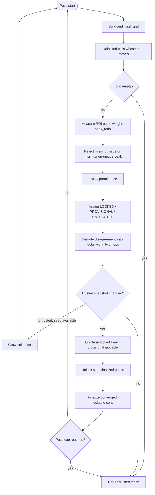

# Refine-grid step inventory

Current as of September 2026. The governing rule is: **only trusted cells shape
the field**. LOCKED and PROVISIONAL records may enter the mesh; UNTRUSTED records
may not. Where fewer than three records are trusted, the input transform stands.

## Current flow

## Active inventory

| # | Step | Module | Trust question | Disposition |
|---:|---|---|---|---|
| 1 | Sticky low-content skip | `source_content_cache.py`, `cell_validity.py` | is there tissue to measure | keep |
| 2 | Ring rigid local prior | `ring_pose_limits.py` | measurement under current field | keep |
| 3 | Dual rigid/exact ROI candidate | `local_distortion_correction.py` | which measured candidate is more unique | keep; serial and batched choose peak ratio then weight |
| 4 | Phase correlation and finite `peak_ratio` | `peak_ratio_gates.py` | is this peak unique | keep; missing fails closed |
| 5 | Displacement regularization | `displacement_regularize.py` | measurement cleanup only | keep |
| 6 | One cell-size growth for zero-trust seeding | `adaptive_cell_size.py` | is there anything trusted at all | keep |
| 7 | ZNCC prominence | `cell_roles.py` | does this peak beat its local null | keep |
| 8 | Tier assignment and cluster seed | `trust_tiers.py` | does this cell agree with trusted neighbours | keep |
| 9 | Prior-moved measurement schedule | `measure_schedule.py` | has the field under this cell changed | keep |
| 10 | Trusted mesh build | `local_distortion_correction.py` | is this record allowed to shape the field | keep |
| 11 | Unlock stale locks | `finalize.py` | does this lock still agree with the field | keep |
| 12 | Finalize stable candidates | `finalize.py` | has this cell converged under the current field | keep |
| 13 | Diagnostics, cell history, timing | `pass_diagnostics.py`, `cell_history.py`, `phase_timer.py` | observability | keep |
| 14 | GPU batch budget and ROI/null caches | `gpu_batch_budget.py`, `MeasuredRoiSink`, `ZnccNullCache` | performance | keep |

## Retired inventory rows

The previous inventory rows 7, 8, 9, 11, 12, 14, 15, 16, 17, and 20 are
retired from `RefineTransform`:

| Former row | Mechanism | Reason retired |
|---:|---|---|
| 7 | coherent residual Track A | field-wide movement inferred from a selected subset |
| 8 | whole-FOV Track B | a global peak could move tissue without local trust |
| 9 | residual remeasure/revert | guard required only by Tracks A/B |
| 11 | discontinuity soft/raw-preserve | admitted cells through a proxy rather than trust |
| 12 | FieldMode identity branding | field-level label replaced by neighbour agreement |
| 14 | best-effort ambiguous promotion | ambiguity can no longer be traded for mesh density |
| 15 | anchor smoothing/raw-preserve | replaced by LOCKED fixed plus PROVISIONAL movable points |
| 16 | travel/REJECT fallback mesh | tier membership is now the only mesh admission path |
| 17 | sparse preserve with absolute floor | trusted sparsity correctly keeps the prior below three points |
| 20 | final anchor smooth/preserve/nudge | final output is the last trusted mesh |

Their absolute point-count constants and feature branches no longer participate
in refine decisions. Compatibility helpers may remain importable for historical
diagnostics, but `RefineTransform` does not call them.

## Fixture expectations

The named expectations and September 2026 A/B measurements are in
[`grid16_rc2_refine_failure_modes.md`](grid16_rc2_refine_failure_modes.md).
Follow-on edits must include one motivating pair and healthy 183-184, reporting
lock fraction and unique-fraction-over-passes.
